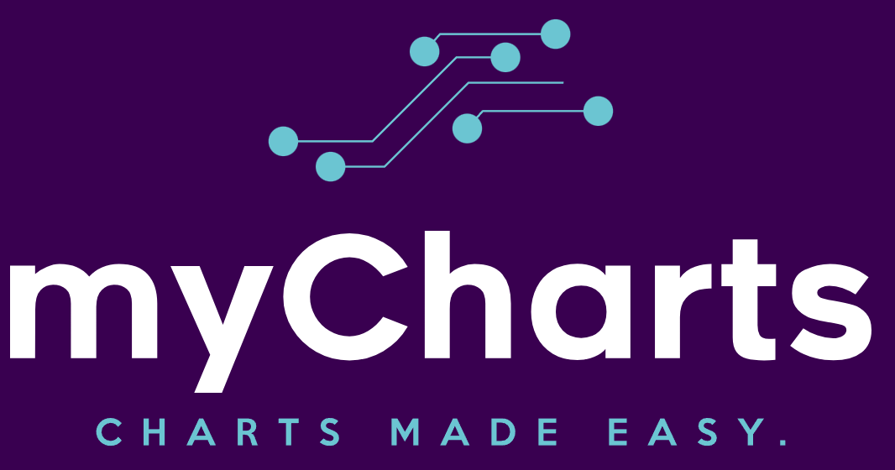
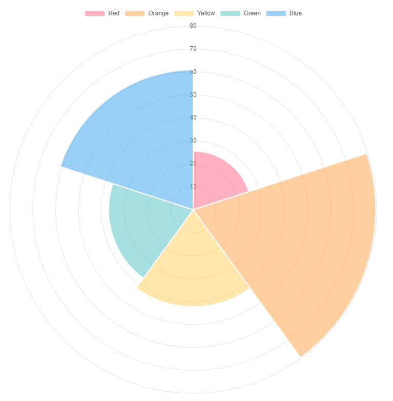
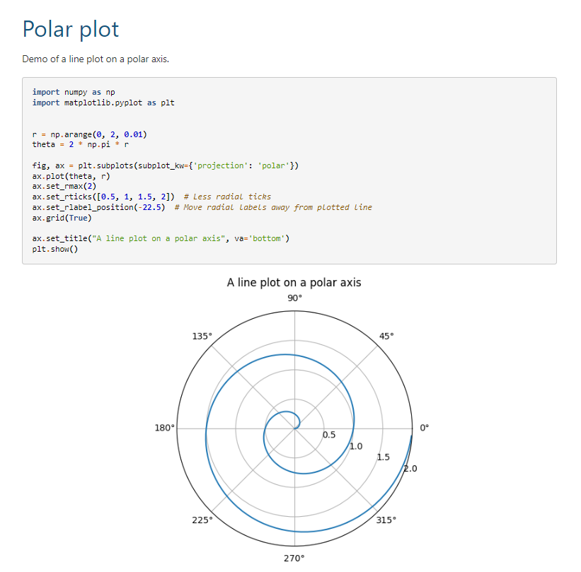
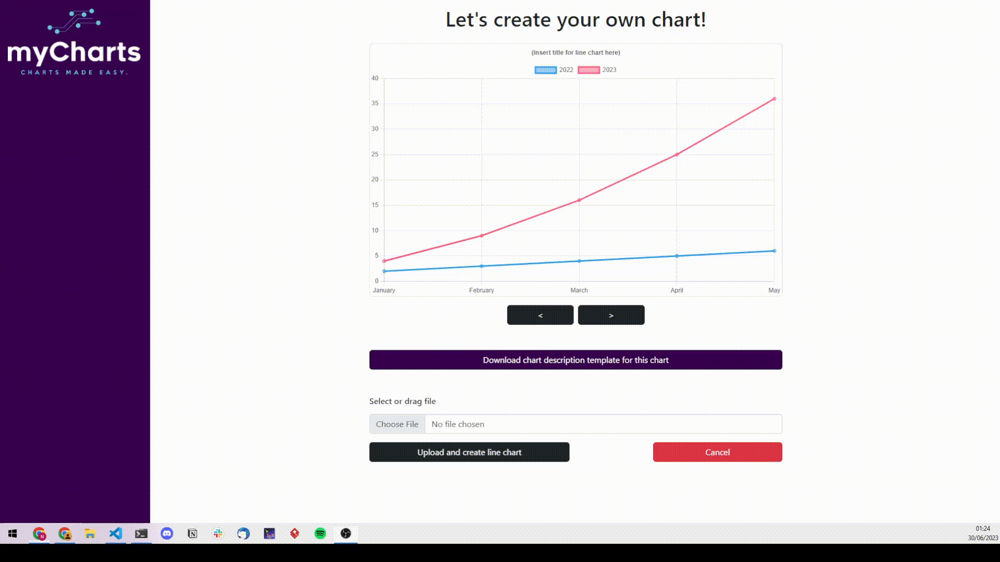
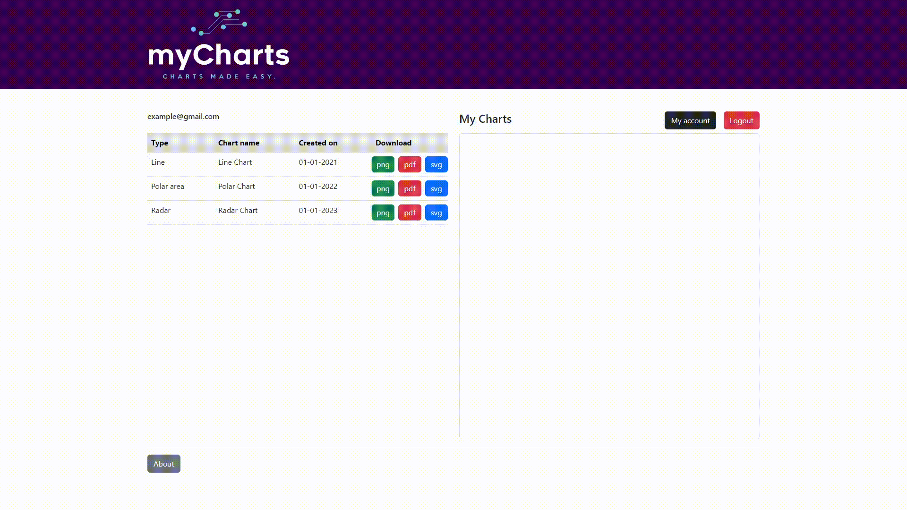

# NTUA ECE SAAS 2023 PROJECT - TEAM 07

## myCharts: Charts made easy.

<p align="center">
  
</p>

### The _Why..._

This is called a **polar area chart**:

<p align="center">
  
</p>

<p align="left">
  Beautiful, isn't it?
</p>
<p>
  Let's google how to make one:
</p>

- With Python and matplotlib:

<p align="center">
  
</p>

Not exactly what we want. Plus, you have to write some code. Even if you know how to do it, it always takes a while to remember which function to call and how.

- Let's try Excel:

<p align="center">
  
</p>

Ouch.

<br/>
<br/>
<br/>
<br/>

<p align="center">
  
</p>

### the _What..._

You have every right to lose your patience at this point, but please wait 20 more seconds!

Because that's how much time you need to do it with **myCharts**:

<p align="center">
  
</p>

Your charts are saved on the cloud, so you can access them from anywhere.

You can download them as png, pdf, svg or html:

<p align="center">
  
</p>

Join us today and get a 7-day free trial!

### ...and the _how?_

To build the app yourself:

```sh
git clone git@github.com:ntua/SaaS23-07.git
cd SaaS23-07
docker compose up
```

### Social

Join us on [Instagram](https://www.instagram.com/saas2023ntua/)!
