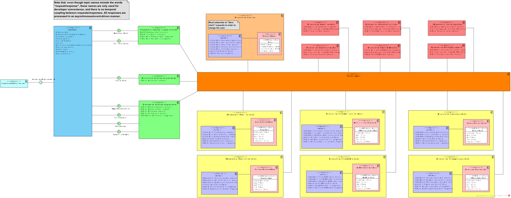
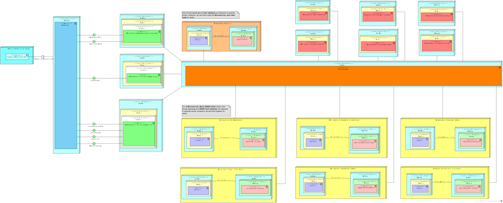

# Documentation

## Contents

A `.vpp` file containing the project architecture. This `.vpp` file contains:

- A **UML Component Diagram** that conceptually describes the application's components, their interfaces, and how they interact,
- A **UML Deployment Diagram** that shows where these components actually run,
- Some **UML Class Diagrams** that show how the application's (NoSQL) databases are structured.

## Component diagram

## Deployment diagram

